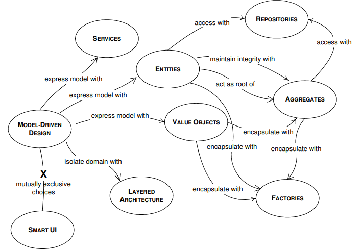
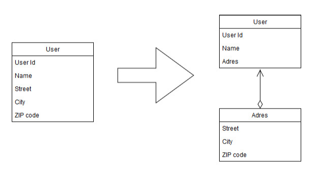
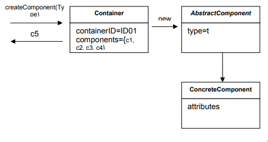
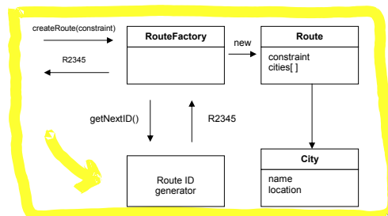

# Domain Driven Design

## Quick DDD Notes

This notes have been taken from the free [Domain Driven Design Quickly
](https://www.goodreads.com/book/show/2558105). I highly recommend reading the
book. I have found it to be a concise summary of the [original
book](https://www.goodreads.com/en/book/show/179133). In this summary I will be
just mentioning/listing the best ideas of the all the concepts mentioned in the
book. 

**Disclaimer:** *There is no strict narrative to this post, just useful ideas
written in a sentence or two to Ctrl+F whenever you hesitate before making a
design decision.*

## Model

The, so called, **Model** is the abstraction of the **Domain**.

The Domain comes to light talking to the _Domain Experts_, which are the
business experts.

The abstraction is the model. This is not a diagram but the idea that the
diagram is intended to convey.

Sometime the domain contain too much, so we must leave parts out of our model.

We should be able to communicate the Model.

- Graphical Diagrams
- Writing
- Language

Only once we are sure we can communicate the model we can start to design our
code.

**Software Design:** The big pictures, where the walls of a house are going to
be placed.

**Code Design:** Detail, where certain painting is going to be hang.

Code design mistakes are easy to correct, the totally opposite happens with
Software design mistakes.

**Analysis Paralysis:** Teams members so afraid of making any design decision
that end up making no progress at all.

## The Ubiquitous Language

One different person uses different words when writing than when speaking.
Sometimes, even in the same sentences.

A core principle of DDD is to use a language **based on the model**.

That language and the models are strongly interconnected with one another. A
change in the language is a change in the model.

**_Domain experts should easily understands the both the language and the
model._**

The language can be expressed in text, diagrams, etc. (UML diagrams are not
recommended by this book)

## Model Driven Design

**Very important details are discovered during the design and implementation
process.** A Model that is truthful to the Domain can turn out to have serious
problems with object persistence, or unacceptable performance behaviour. The
Model should be constructed with an eye open to the software and design
considerations. **Developers should be included in the modeling process**. This
ensures that the model can actually be implemented.

"Procedural programming does not suit well Model driven Design"

### The building blocks of a Model Driven Design

## Layered Architecture

A common architectural solution for domain-driven designs contain four
conceptual layers:

**User Interface** (Presentation Layer): Responsible for presenting information
to the user and interpreting user commands.

**Application Layer:** This is a thin layer which coordinates the application
activity. It does not contain business logic. It does not hold the state of the
business objects, but it can hold the state of an application task progress.

**Domain Layer:** This layer contains information about the domain. This is the
heart of the business software. The state of business objects is held here.
Persistence of the business objects and possibly their state is delegated to the
infrastructure layer.

**Infrastructure Layer:** This layer acts as a supporting library for all the
other layers. It provides communication between layers, implements persistence
for business objects, contains supporting libraries for the user interface
    layer, etc.

## Entities

Entities are necessary objects in the domain model and should be considered from
beginning of the modeling.

An Object must be an Entity as long as it has identity. For these objects is not
the attributes that matter, but the thread of continuity and identity.

Usually the identity is either an attribute of the object, a combination of
attributes or an attribute specially created to preserve and express identity,
or even a behaviour.  The "ID" could be auto generated by a module, could be the
PK of a table in a DB or it could be created by the user.

This means of identification may come from outside or it may be created by and
for the system, bit it must correspond to the identity distinctions in the
    model.  The model must define what it means to be the same thing.

Beware of considering all objects entities, there may be performance issues.
(Consider the case of a drawing App explained in the book)

## Value Objects

There are cases where we need to contain some attributes of a domain element we
are not interested in which object it is, but what attributes it has. An object
that is used to describe certain aspects of a domain, and which does not have
identity, is name value object.

It is highly recommendable that these objects are immutable, even more if they
are sharable

Value objects  should stay thin, making a copy of a V.O should be easy.

Value Objects, can contain other value objects, and they can even contain
references to entities. Although V.O attributes of a domain object, that does
not mean that it should contain a long list with all the attributes.  Attributes
can be grouped in different objects. Attributes chosen to make up a V.O should
form a conceptual whole.
 

## Services

Some aspects of the domain are not easily mapped to objects,. Objects are
generally considered as having attributes, an internal state which is managed by
the object, and exhibit a behaviour.

The nouns of the language are easily mapped to objects, the verbs of the
language become the part of the behaviour of those objects. But there are some
actions in the domain, some verbs, which do not seem to belong to any object.
They represent an important behaviour of the domain, so they cannot be neglected
or simply incorporated to some of the Entities or Value Objects. Nonetheless,
using an OO language, we have to use an object for this purpose. 

When such a behaviour is recognized in the domain, the best practice is to
declare it as a Service. Such object does not have an internal state, and it
purpose is to provide functionality to the domain. The Service can group related
functionality which serves Entities and Value Objects. 

Services must be declared explicitly, they must encapsulate a concept. We should
not create a Service for each operation needed. But when such an operation
stands out as an important concept in the domain.

A Service is not about the object performing the service, but is related to the
objects the operations are performed on/for. They usually become the point of
connection for many objects.

There are 3 characteristics of a Service:

1. The operation performed by a Service refers to a domain concept which does
not naturally belong to an Entity or Value Object

2. The operation performed refers to other objects in the domain.

3. The operation is stateless

It is easy to confused services which belongs to the domain and those that
belong to the infrastructure. (To read more about it please refer to the last
part of the "Service" chapter where some examples are provided)

## Modules

The model reaches a point where it is hard to talk about as a whole and
understanding the relationships and interaction between different parts becomes
difficult. For that reason, it is necessary to organize the model into modules.

Using modules in design is a way to increase cohesion and decrease coupling.
Modules should be made up of elements which functionally or logically belongs
together assuring cohesion. Modules should have wall defined interfaces which
are accessed by other modules instead of calling three objects of a module, it
is better to access one interface, because it reduces coupling. Low coupling
reduces complexity, and increases maintainability. It is easier to understand
how a system functions when there are few connections between modules. 

It is widely accepted   that software code should have a high level of cohesion
and low level of coupling.

There are several types of cohesion. Two of the most used are **communicational
cohesion** and **functional cohesion** . 

Communicational cohesion is achieved when parts of the module operate on the
same data. It makes sense to group the because there is a strong relationship
between them.

Functional cohesion is achieved when all parts of the modules work together to
perform a well-defined task. This is consider the best type of cohesion.

Chose modules that tells the story of the system and contain a cohesive set of
concepts.

Seek low coupling in the sense of concepts that can be understood and reasoned
about independently of each other.

Give the modules names that become part of the Ubiquitous Language. Name of
modules should reflect insights into the domain.

## Modeling Domain Objects (Aggregates)?

The last three patterns in this chapter will deal with a different modeling
challenge, one related to the life cycle of domain objects. Domain objects go
through a set of states during their life time. They are created, placed in
memory and used in computations, and they are destroyed. In some cases they are 
saved in permanent locations, like a database, where they can be retrieved from
some time later, or they can be archived.

No matter how much consideration we put in the design, it happens that many
objects are associated with one another, creating a complex net of
relationships. There are several types of associations. For every traversable
association in the model, there has to be corresponding software mechanism which
enforces it. Real associations between domain object end up in the code, and
many times even in the database. A one-to-one relationship between a customer
and the bank account opened on his name is expressed as a reference between two
objects, and implies a relationship between two database tables, the one which
keeps the customers and the one which keeps the accounts.  

Most of the time it pays of to eliminate or simplify relations from the model.
That is, unless they embed deep understanding of the domain.

A one-to-many association is more complex because it involves many objects which
become related. This relationship can be simplified by transforming it into an
association between one object and a collection of other objects, although it is
not always 

There are many-to-many associations and a large number of theme are
bidirectional. Associations which are not essential for the model should be
removed. They may exist in the domain, but they are not necessary in our model,
so take them out. 
Multiplicity can be reduced by adding a constraint. If many
objects satisfy a relationship, it is possible that only one will do it if the
right constraint is imposed on the relationship.
Many time bidirectional relationships can be transformed in unidirectional ones.

When domain objects are related and any of them changes (deleted, modified, etc.)
the system needs to make sure that is is properly updated throughout the system,
and data integrity is guaranteed. This is usually left to be addressed at
database level. Transactions are used to enforce data integrity.

While database transactions play a vital role in such operations, it is
desirable to solve some of the problems related to data integrity directly in
the model.

It is also necessary to be able to enforce the invariants. The invariants are
those rules which have to be maintained whenever data changes.

Therefore use Aggregates

## Aggregates

Aggregate is a domain pattern used to define object ownership and boundaries.
Factories and Repositories are two design patterns which help us deal with
object creation and storage.

An  Aggregate is a group of associated objects which are considered as one unit
with regard to data changes. The Aggregate is demarcated by a boundary which
separated the objects inside from those outside. Each Aggregate has one root.
The root is an Entity, and it is the only object accessible from outside. The
root can hold references to any of the aggregate objects, and the other objects
can hold references to each other, but an outside object can hold references
only to the root object. If there are other Entities inside the boundary, the
identity of those entities is local, making sense only inside the aggregate.

How is the Aggregate ensuring data integrity and enforcing the invariants? Since
other objects can hold references only to the root, it means that they cannot
directly change the other objects in the aggregate. All they can do is to change
the root, or ask the root to perform some actions. And the root will be able to
change the other objects, but that is an operation contained inside the
aggregate, and it is controllable. If the root is deleted and removed from
memory, all the other objects from the aggregate will be deleted too, because
there is no other object holding reference to any of them.  

It is possible for the root to pass transient references of internal objects to
external ones, with the condition that the external objects do not hold the
reference after the operation is finished.  One simple way to do that is to pass
copies of the Value Objects to external objects. It does not really matter what
happens to those objects, because it won't affect the integrity of the aggregate
in any way. 

If objects of an Aggregate are stored in a database, only the root
should be obtainable through queries. The other objects should be obtained
through traversal associations.  

Objects inside an Aggregate should be allowed to hold references to roots of
other Aggregates.

The root Entity has global identity, and is responsible for maintaining the 
invariants. Internal Entities have local identity.  

Cluster the Entities and Value Objects into Aggregates and define boundaries
around each.  Choose one Entity to be the root of each Aggregate, and control
all access to the objects inside the boundary through the root. Allow external
objects to hold references to the root only. Transient references to internal
members can be passed out for use within a single operation only. Because the
root controls access, it cannot be blindsided by changes to the internals. This
arrangement makes it practical to enforce all invariants for objects in the
Aggregate and for the Aggregate as a whole in any state change.

## Factories

Entities and Aggregates can often be large and complex – too complex to create in the constructor of the root entity. Infact trying to construct a complex aggregate in its constructure is in contradiction with what often happens in the domain itself.

When the object construction is a laborious process, creating the object involves a lot of knowledge about the internal structure of the object, about the relationships between the objects contained, and the rules applied to them. This means that each client of the object will hold specific knowledge about the object built. This breaks encapsulation of the domain objects and of the Aggregates. If the client belongs to the application layer, a part of the domain layer has been moved outside, messing up the entire design. In real life, it is like we are given plasti

Factories are used to encapsulate the knowledge necessary for object creation, and they are especially useful to create Aggregates. When the root of the Aggregate is created, all the objects contained by the Aggregate are created along with it, and all the invariants are enforced.

It is important for the creation process to be atomic. If it is not, there is a chance for the creation process to be half done for some objects, leaving them in an undefined state.

When the root is created, it is necessary that all objects subject to invariants are created too.

For immutable Value Objects it means that all attributes are initialized to their valid state. If an object cannot be created properly, an exception should be raised.

Therefore, shift the responsibility for creating instances of complex objects and Aggregates to a separate object, which may itself have no responsibility in the domain model but is still part of the domain design. Provide an interface that encapsulates all complex assembly and that does not require the client to reference the concrete classes of the objects being instantiated. Create entire Aggregates as a unit, enforcing their invariants.

A Factory Method is an object method which contains and hides knowledge necessary to create another object. This is very useful when a client wants to create an object which belongs to an Aggregate. The solution is to add a method to the Aggregate root, which takes care of the object creation, enforces all invariants, and returns a reference to that object, or to a copy of it.

There are times when the construction of an object is more complex, or when the creation of an object involves the creation of a series of objects. For example: the creation of an Aggregate. Hiding the internal construction needs of an Aggregate can be done in a separate Factory object which is dedicated to this task. Let’s consider the example of a program module which

The Route ID generator is used to create a unique identity for each route which is necessary for an Entity.

When creating a Factory, we are forced to violate an object’s encapsulation. Whenever something changes in the object that has an impact on construction rules or on some of the invariants, we need to make sure the Factory is updated to support the new condition. Factories are tightly related to the objects they are created.

There has to be some logic which puts together an Aggregate. The logic does not naturally belong to any of the objects, because it is about the construction of other objects. It seems appropriate to use a special Factory class

There are times when a Factory is not needed, and a simple constructor is enough. Use a constructor when:

- The construction is not complicated.
- The creation of an object does not involve the creation of others, and all the attributes needed are passed via the constructor.
- The client is interested in the implementation, perhaps wants to choose the Strategy used.
- The class is the type. There is no hierarchy involved, so no need to choose between a list of concrete implementations.

Another observation is that Factories need to create new objects from scratch, or they are required to reconstitute objects which previously existed, but have been probably persisted to a database. Bringing Entities back into memory from their resting place in a database involves a completely different process than creating a new one. One obvious difference is that the new object does not need a new identity

## Repositories

The purpose of a Repository is to encapsulate all the logic needed to obtain object references. The domain objects won’t have to deal with the infrastructure to get the needed references to other objects of the domain.  They will just get them from the Repository and the model is regaining its clarity and focus. 

The Repository may store references to some of the objects. When an object is created, it may be saved in the Repository, and retrieved from there to be used later.  If the client requested an object from the Repository, and the Repository does not have it, it may get it from the storage. Either way, the Repository acts as a storage place for globally accessible objects. 

The Repository may also include a Strategy. It may access one persistence storage or another based on the specified Strategy. It may use different storage locations for different type of objects. The overall effect is that the domain model is decoupled from the need of storing objects or their references, and accessing  

Provide Repositories only for aggregate roots the that actually need direct access.

A Repository may contain detailed information used to access the infrastructure, but its interface should be simple. A Repository should have a set of methods used to retrieve objects. The client calls such a method and passes one or more

There is a relationship between Factory and Repository. They are both patterns of the model-driven design, and they both help us to manage the life cycle of domain objects. While the Factory is concerned with the creation of objects, the Repository takes care of already existing objects. The Repository may cache objects locally, but most often it needs to retrieve them from a persistent storage. Objects are either created using a constructor or they are passed to a Factory to be constructed. For this reason, the Repository may be seen as a Factory, because it creates  objects. It is not a creation from scratch, but a reconstitution of an object which existed. We should not mix a Repository with a Factory. The Factory should create new objects, while the Repository should find already created objects. When a new object is to be added to the Repository, it should be created first using the Factory, and then it should be given to the Repository which will store it like in the example below.    

Another way this is noted is that Factories are "pure domain", but that Repositories can contain links to the infrastructure, eg. the database.

